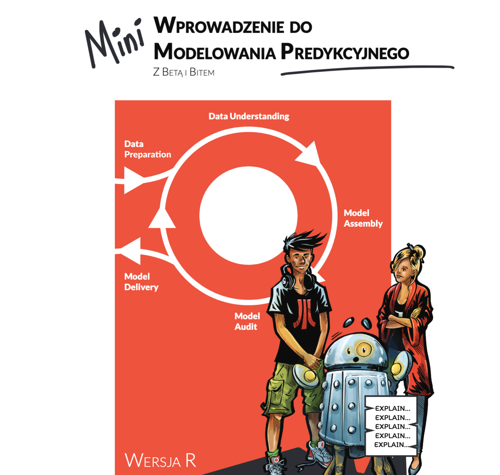

# Wprowadzenie do Modelowania Predykcyjnego

Ta książka splata teorię, przykłady i procesy istotne dla tworzenia modeli zgodnie z regułami Odpowiedzialnego Uczenia Maszynowego (ang. Responsible Machine Learning). Znajdziesz tutaj intuicje i przykłady dla Interpretable Machine Learning (IML) i eXplainable Artificial Intelligence (XAI). Opisy uzupełnione są o fragmenty kodu z przykładami dla R z wykorzystaniem pakietów randomForest, mlr3 i DALEX. Wreszcie, proces tworzenia modeli jest pokazany poprzez komiks opisujący przygody dwóch postaci, Bety i Bita. Interakcja tych dwóch postaci pokazuje decyzje, przed którymi często stają analitycy, czy wypróbować inny model, inną technikę eksploracji lub poszukać innych danych -- pytania jak porównywać modele lub je weryfikować.

Wszystkie przykłady są w pełni odwtarzalne, tak że można te wszystkie przygody odtworzyć na lokalnym komputerze.

Tworzenie modeli jest odpowiedzialnym i wymagającym zadaniem, ale także ekscytującą przygodą. Czasami podręczniki skupiają się tylko na stronie technicznej, tracąc całą zabawę. Tutaj będziemy mieć jedno i drugie.


## Materiały

* Darmowa wersja online: https://betaandbit.github.io/MiniML/
* Kup plik pdf na LeanPub: https://leanpub.com/RML
* Odtwarzalny skrypty z kodem dla R: [html](https://htmlpreview.github.io/?https://github.com/BetaAndBit/MiniML/blob/main/data/MiniML.html)
* Odtwarzalny skrypty z kodem dla R: [Rmd](data/MiniML.Rmd)
* Dane: [covid_spring.csv](data/covid_spring.csv)
* Dane: [covid_summer.csv](data/covid_summer.csv)
* Wersja angielska komiksu i danych: [https://github.com/BetaAndBit/RML](https://github.com/BetaAndBit/RML)

Należy pamiętać, że są to dane sztuczne wygenerowane w celu naśladowania relacji występujących w rzeczywistych danych.

### Intro 



### Komentarze:

#### Dianne Cook


EN: Dianne Cook is Professor of Business Analytics at Monash University in Melbourne, Australia. Her research is in the area of data visualisation, especially the visualisation of high-dimensional data using tours with low-dimensional projections, and projection pursuit. A current focus is on bridging the gap between exploratory graphics and statistical inference.

```
The Hitchhikers Guide to Responsible Machine Learning is a delightful read. I had to flip 
from comic to comic first, which is fun and also on point about not falling into a pit 
of errors when doing machine learning with data. The detailed text explanations and 
beautifully constructed margin figures provide filling to the sandwich. 
Congratulations to Przemek, Anna and Aleksander for a creative and insightful 
contribution to the explainable AI literature.

Di Cook, Hitchhiker in high-dimensional spaces
```

#### Marek Stączek

Coach, storyteller, author of books

PL:

```
Dwóch studentów Politechniki Warszawskiej szło łeb w łeb w konkursie ogłoszonym przez NASA. Wygrał Mietek Bekker 
i to jego Lunar Roving Vehicle, w statku Apollo poleciał na księżyc.  Jak rodzą się tacy studenci? Przez kontakt 
z wyjątkowymi nauczycielami. A co charakteryzuje tych drugich? Oryginalny i inspirujący przekaz.

Do Waszych rąk trafia podręcznik profesora Przemysława Biecka, który nawiązuje do takich wzorców.
```

EN:

```
Two students from the Warsaw University of Technology went head to head in a competition announced by NASA. 
Mietek Bekker won, and it was his Lunar Roving Vehicle in the Apollo spacecraft that flew to the moon.  
How are such students born? Through contact with exceptional tutors. And what characterises the latter? 
An original and inspiring delivery.

An exceptional textbook by professor Przemysław Biecek is now in your hands.
```

####  Łukasz Rajkowski

editorial board of Polish popular science monthly Delta


PL:

```
Niniejsza książka jest krótką, lecz pouczającą i wciągającą wycieczką po odpowiedzialnym uczeniu maszynowym, 
w której dokładne wytłumaczenia fundamentalnych koncepcji są umiejętnie wplecione we wdzięczną i atrakcyjnie 
zilustrowaną fabułę. W sposób przyjazny turyście wskazuje ona na pewne ważne aspekty wnioskowania z danych 
oraz pozwala rzucić okiem na to, jak tego typu analizy są (lub przynajmniej powinny być) przeprowadzane. 
Należy zwrócić uwagę, że od Czytelnika nie wymaga się profesjonalnego, podróżniczego ekwipunku - otwarty 
umysł oraz solidne matematyczne przygotowanie na poziomie szkoły średniej z pewnością wystarczą. Nie trzeba 
chyba dodawać, że nie wystarczy powrócić z tej wycieczki aby stać się ekspertem w "data science" - jest to 
wszak ogromna (i fascynująca) dziedzina, która może być porównana do podróży tysiąca mil. Wiemy jednak 
doskonale, że takie podróże rozpoczynają się od pierwszego kroku... lub złapania autostopu!
```

EN:

```
This book is a short but illuminating and entertaining trip to responsible machine learning, in which 
accurate explanations of some fundamental concepts successfully mingle with a pleasant, richly illustrated 
storyline. In a tourist-friendly manner it points out some important aspects of inference from the data 
and gives you a glimpse of how data driven answers are (or at least should be) obtained. Note that no 
professional travelling equipment is required - an open mind and a solid high-school level of mathematical 
abilities will certainly suffice. Needless to say, finishing this tour won't make you an expert in data 
science - a vast and fascinating field which can be compared to a journey of a thousand miles. But we all 
know that such journeys begin with a single step... or a hitchhiker's guide!
```

